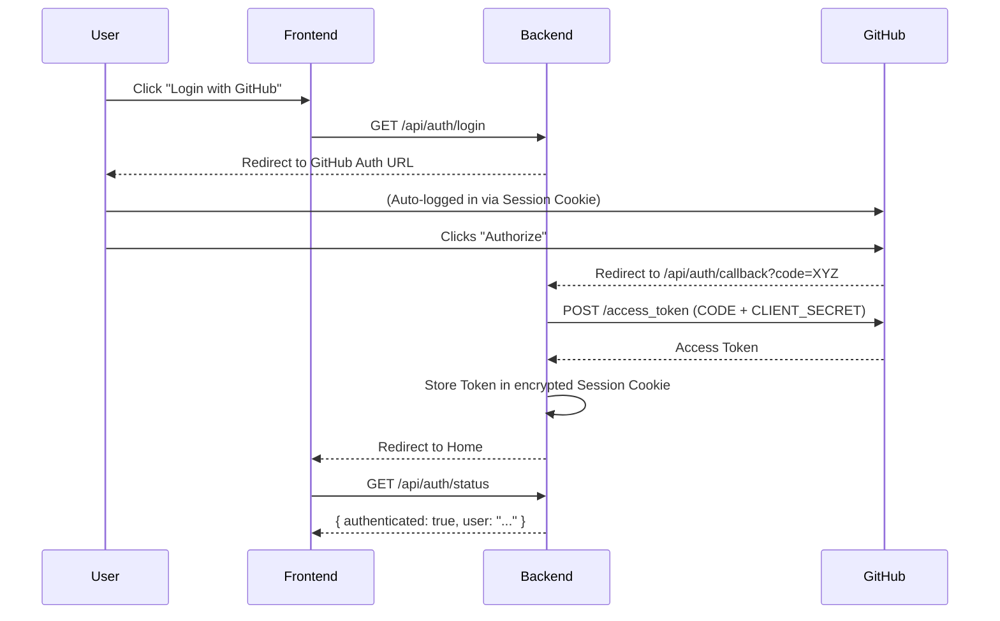

# Proposal: GitHub OAuth for Seamless Session Authentication

## 1. Overview
The current implementation of the GitHub Analyzer requires users to manually generate a Personal Access Token (PAT) and configure it in the `.env` file. This proposal outlines a shift toward **GitHub OAuth 2.0**, allowing the application to leverage the user's existing browser session on GitHub for a "zero-configuration" user experience.

## 2. Theoretical Background: "Leveraging the Browser Session"
While a web application cannot directly access GitHub's session cookies due to the **Same-Origin Policy (SOP)**, it can use the **OAuth Web Application Flow** to take advantage of them:
1. When the user clicks "Login with GitHub," the app redirects the browser to GitHub.
2. Since the user is already logged into GitHub in that browser, GitHub recognizes the session and simply asks the user to "Authorize" the application.
3. Upon clicking "Authorize," GitHub redirects back to our application with a temporary code, which the backend exchanges for a token.

## 3. Architecture

### 3.1 Components
- **GitHub OAuth App**: Registered on GitHub, provides `CLIENT_ID` and `CLIENT_SECRET`.
- **Backend (FastAPI)**:
    - **Session Middleware**: Stores an encrypted session cookie in the user's browser to maintain the authenticated state.
    - **Auth Endpoints**: Paths for triggering the login redirect and handling the callback.
- **Frontend (Angular)**:
    - **Auth Service**: Manages login state and UI visibility based on authentication.



## 4. Proposed Implementation Details

### 4.1 Backend Changes
- **Dependencies**: Add `itsdangerous` (for signed sessions) and `httpx` (for async HTTP requests to GitHub).
- **Session Middleware**:
  ```python
  from starlette.middleware.sessions import SessionMiddleware
  app.add_middleware(SessionMiddleware, secret_key=os.getenv("SESSION_SECRET"))
  ```
- **Auth Routes**:
    - `GET /api/auth/login`: Constructs the GitHub authorization URL and redirects the user.
    - `GET /api/auth/callback`: Exchanges the code for a token and stores it in `request.session['gh_token']`.
    - `GET /api/auth/status`: Checks the session and returns user metadata.
    - `POST /api/auth/logout`: Clears the session.

### 4.2 Frontend Changes
- **Login Component**: A header component showing "Login" or the user's GitHub avatar.
- **Interceptors**: An Angular HTTP Interceptor to ensure `withCredentials: true` is set for all API calls, allowing the browser to send the session cookie to the backend.

## 5. Security Considerations
- **Secure Cookies**: Use `secure=True`, `httponly=True`, and `samesite='lax'` for the session cookie to prevent CSRF and XSS-based session theft.
- **State Parameter**: Implement the `state` parameter in the OAuth flow to prevent Cross-Site Request Forgery (CSRF).
- **Scope Management**: Request only the minimum necessary scopes (e.g., `read:user`, `public_repo`).

## 6. Benefits vs. Costs
| Benefit | Cost |
| :--- | :--- |
| **No manual token generation** for the end-user. | **One-time setup** of a GitHub OAuth App by the developer. |
| **Seamless user experience** (two-click login). | Requires **session management** on the backend. |
| **Revocable access**: User can revoke the app in GitHub settings. | Slightly more complex **CORS configuration**. |

## 7. Recommendation
Moving to OAuth is highly recommended for any tool intended to be used by others. It follows industry standards and provides a significantly lower barrier to entry for new users compared to the manual PAT setup.
